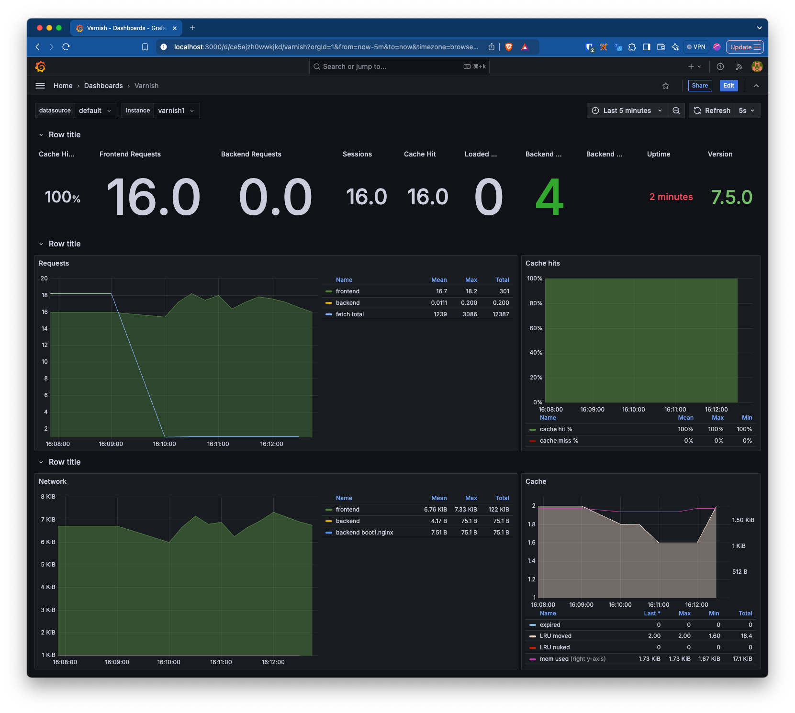
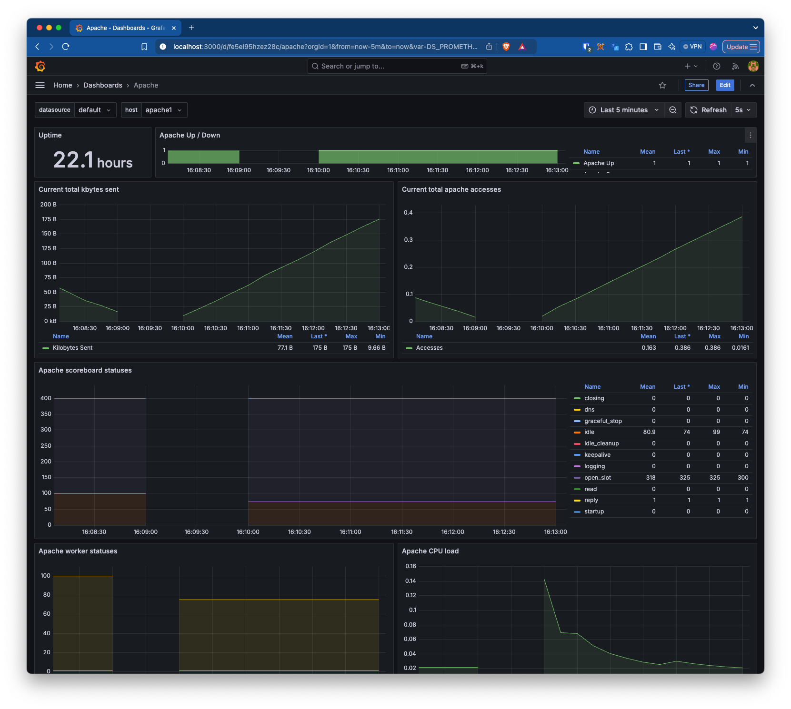
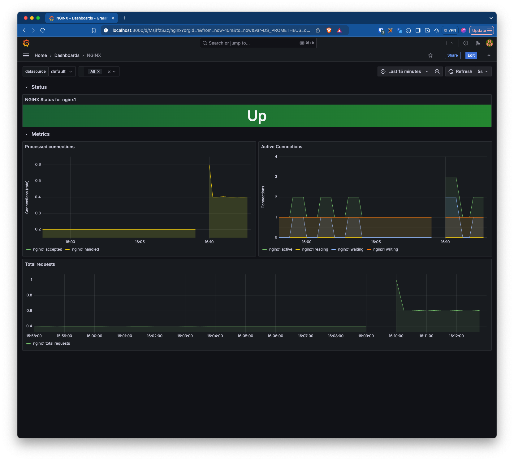

# Monitoring with Prometheus & Grafana

This project provides a starting point for setting up and monitoring a web stack using **Varnish** as a caching layer in front of **Apache** and **Nginx** backends. Monitoring is handled via **Prometheus**, with dashboards visualized in **Grafana**. Dashboards are preloaded and cannot be deleted, serving as examples for further customization. The project is designed to extend into a combined monitoring system for various components.

## Architecture  

The system works as follows:

- The web servers (Apache and Nginx) and Varnish are monitored using exporters which feed into Prometheus. 
- All metrics are scraped by Prometheus who pulls from the exporters and stores them in a time series database at a regular interval.
- Grafana is used to visualize the metrics.
- Alerts can be configured using Prometheus Alertmanager.

---

## Components

### Web Servers
- **Apache**: HTTP server backend.
  - Monitored using Bitnami Apache Exporter.
  - [Apache Exporter Documentation](https://github.com/Lusitaniae/apache_exporter)

- **Nginx**: HTTP server backend.
  - Monitored using the official Nginx Prometheus Exporter.
  - [Nginx Exporter Documentation](https://github.com/nginxinc/nginx-prometheus-exporter)

### Cache Layer
- **Varnish**: High-performance HTTP accelerator and caching server.
  - Includes a custom Varnish Exporter for Prometheus.
  - [Varnish Exporter Documentation](https://github.com/MooncellWiki/varnish_exporter)

### Monitoring and Visualization
- **Prometheus**: Collects and stores metrics.
  - [Prometheus Documentation](https://prometheus.io)

- **Grafana**: Visualizes metrics with interactive dashboards.
  - [Grafana Documentation](https://grafana.com/oss/grafana)

### System Metrics
- **cAdvisor**: Collects metrics about container resource usage.
  - [cAdvisor Documentation](https://github.com/google/cadvisor)

---

## Directory Structure

```
project-root/
├── apache/
│   ├── httpd.conf        # Apache server configuration
├── nginx/
│   ├── nginx.conf        # Nginx server configuration
├── varnish/
│   ├── default.vcl       # Varnish configuration
│   ├── exporter/         # Custom Varnish Exporter Docker context
├── prometheus/
│   ├── prometheus.yml    # Prometheus configuration
├── grafana/
│   ├── dashboards/       # Grafana JSON dashboards
│   ├── provisioning/     # Datasources and dashboard provisioning
├── html/
│   ├── apache/           # Apache web content
│   ├── nginx/            # Nginx web content
├── varnish_exporter/     # Subdirectory for Varnish exporter setup
├── docker-compose.yml    # Docker Compose configuration
```

---

## Setup and Usage

1. **Clone the Repository**:

   ```bash
   git clone https://github.com/your-repo/monitoring.git
   cd webmonitoring
   ```

2. **Copy the .env.example file to .env and set the variables**:
   
   ```bash
   cp .env.example .env
   ```

   This ensures that the docker containers are not colliding with other using the same names

3. **Start the Stack**:
   Use `docker compose` to build and run all services:

   ```bash
   docker compose up --build -d
   ```

4. **Access Services**:
   - **Apache**: [http://localhost:8081](http://localhost:8081)
   - **Nginx**: [http://localhost:8082](http://localhost:8082)
   - **Varnish (nginx)**: [http://localhost:8080](http://localhost:8080)
   - **Varnish (apache)**: [http://localhost:8080/apache/](http://localhost:8080/apache/)
   - **Prometheus**: [http://localhost:9090](http://localhost:9090)
   - **Grafana**: [http://localhost:3000](http://localhost:3000)  
     Default credentials: `admin / admin`
   - **cAdvisor**: [http://localhost:8085](http://localhost:8085)

---

## Preloaded Dashboards

This setup includes preloaded Grafana dashboards for:

- **Varnish**


- **Apache**


- **Nginx**


These dashboards are installed during setup and cannot be deleted. They serve as examples and starting points for further customization.

---

## Customization

1. **Update Dashboards**:
   Place custom Grafana dashboards in the `grafana/dashboards/` directory.

2. **Add Prometheus Targets**:
   Update the `prometheus/prometheus.yml` file to include additional exporters or targets.

3. **Extend Monitoring**:
   Add more exporters and configure corresponding dashboards to monitor additional services or components.

---

## Troubleshooting

1. **Service Not Accessible**:
   - Check if the service is running:
     ```bash
     docker compose ps
     ```
   - Review logs:
     ```bash
     docker compose logs <service_name>
     ```

2. **Metrics Missing in Prometheus**:
   - Verify the exporter is running and correctly configured.
   - Check Prometheus targets: [http://localhost:9090/targets](http://localhost:9090/targets).

3. **Grafana Dashboards Not Loading**:
   - Ensure the provisioning directory is correctly mapped in `docker-compose.yml`.
   - Check Grafana logs:
     ```bash
     docker compose logs grafana
     ```

---

## Links and Resources

- [Apache Exporter Documentation](https://github.com/Lusitaniae/apache_exporter)
- [Nginx Prometheus Exporter Guide](https://github.com/nginxinc/nginx-prometheus-exporter/blob/main/grafana/README.md)
- [Varnish Exporter Documentation](https://github.com/MooncellWiki/varnish_exporter)
- [Prometheus Documentation](https://prometheus.io)
- [Grafana Documentation](https://grafana.com/oss/grafana)
- [cAdvisor Documentation](https://github.com/google/cadvisor)

---

